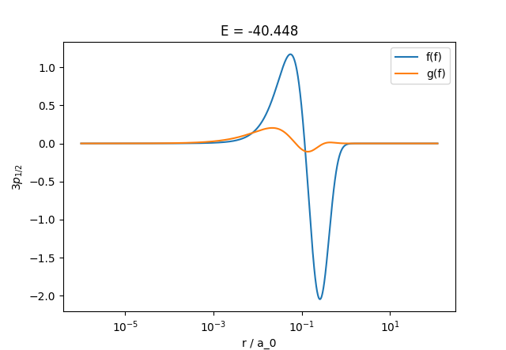
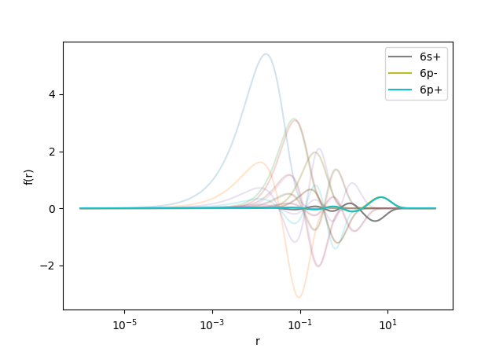

\page tutorial_json JSON output and scripting

\brief JSON output and scripting with ampsci

ampsci can write certain output data to a JSON file, which can be handy if trying to use computed wavefunction in, e.g., a python script.

This is done by setting `json_out` to `true` in the main `Atom{}` block:

```java
Atom{
  Z;
    // Atomic number or symbol (e.g., 55 or Cs). [H]
  A;
    // Atomic mass number, for nuclear parameters including
    // finite nuclear size. Default based on Z.
  varAlpha2;
    // Fractional variation of the fine-structure constant,
    // alpha^2: (a/a0)^2. Use to enforce the
    // non-relativistic limit (c->infinity => alpha->0), or
    // calculate sensitivity to variation of alpha. [1.0]
  run_label;
    // Optional label for output identity - for
    // distinguishing outputs with different parameters
  json_out;
    // Write (partial) wavefunction details to json file?
    // true/false [false]
}
```

The output filename will be `<identity>.json`, where:

* `<identity> = atomic_symbol + Z_ion + b + q + label`
  * atomicSymbol, e.g., 'Cs'
  * Z_ion is ionisation degree for Core (often 1)
  * b and q, charecters if Breit/QED is included
  * label is optional run_label

## String input, json output

* This can be particularly useful when combined with ampsci's string input option.
* Instead of putting inputs into a file, they can be sent in as a formatted string.
* This can be useful if running ampsci from a script.
* For example:

<div class="shell-block">
```bash
./ampsci -s "Atom{Z=Cs; json_out=true;} HartreeFock{Core=[Xe]; valence=6sp;}"
```
</div>

This should produce output: `Cs1.json`

## Output format and example

Output format is described by a top-level `metedata` field:

```json
    "metadata": {
        "description": "This JSON object contains atomic structure data including radial grid, nuclear properties, and wavefunctions.",
        "nucleus": {
            "A": "Mass number",
            "I": "Nuclear spin (based on A)",
            "L": "Orbital angular momentum, based on I and parity",
            "Z": "Atomic number",
            "mu": "Nuclear magnetic moment (from lookup table, based on A)",
            "parity": "Nuclear parity (+1 or -1), based on A",
            "r_rms": "RMS charge radius [fm]"
        },
        "radial": {
            "dr": "Step size between radial points [a.u.]",
            "r": "Array of radial grid points [a.u.]"
        },
        "wavefunctions": {
            "core": "Core wavefunctions",
            "example": "To get the 3p_1/2 core energy: json['wavefunctions']['core']['3p-']['en'] (use double quotes in real JSON)",
            "muon": "Valence muonic wavefunctions",
            "note": "Each of 'core', 'valence', and 'muon' contains a 'list' of orbital labels (e.g., '2s+'), and corresponding entries/orbtials keyed by those labels. Each entry has the fields listed in 'orbital_fields'.",
            "orbital_fields": {
                "2j": "Twice the total angular momentum (integer)",
                "en": "Orbital energy [a.u.]",
                "f": "Upper radial component values (array over r)",
                "g": "Lower radial component values (array over r)",
                "j": "Total angular momentum (j = 2j / 2)",
                "kappa": "Dirac angular quantum number (κ)",
                "l": "Orbital angular momentum",
                "n": "Principal quantum number"
            },
            "valence": "Valence electronic wavefunctions"
        }
    },
```

For example, to get the energy, upper radial wavefunction \f$f(r)\f$, and dirac quantum number \f$\kappa\f$ for the \f$3p_{1/2}\f$ state:

```py
import json
import numpy as np

# Open and load the JSON file
with open("Cs1.json", "r") as f:
    json_file = json.load(f)

# radial grid:
r = np.array(json_file["radial"]["r"])

# energy and Dirac quantum number:
Energy = json_file["wavefunctions"]["core"]["3p-"]["en"]
kappa = json_file["wavefunctions"]["core"]["3p-"]["kappa"]

# upper and lower radial wavefunction components:
f = np.array(json_file["wavefunctions"]["core"]["3p-"]["f"])
g = np.array(json_file["wavefunctions"]["core"]["3p-"]["g"])

# Plot:
import matplotlib.pyplot as plt

plt.xscale("log")
plt.xlabel("r / a_0")
plt.ylabel(f"$3p_{{1/2}}$")
plt.title(f"E = {Energy:.3f} au")
plt.plot(r, f, label="f(f)")
plt.plot(r, g, label="g(f)")
plt.legend()
plt.show()
```

which should produce:



Another example, plots all core wavefunctions (\f$f(r)\f$ only) in light, and valence wavefunctions solid with labels:

```py
core = json_file["wavefunctions"]["core"]
valence = json_file["wavefunctions"]["valence"]

# List of "keys"
core_states = core["list"]
valence_states = valence["list"]

# List of arrays for each f(r)
core_f_list = [np.array(core[nk]["f"]) for nk in core_states]
valence_f_list = [np.array(valence[nk]["f"]) for nk in valence_states]

import matplotlib.pyplot as plt

plt.xscale("log")
for symbol, f in zip(core_states, core_f_list):
    plt.plot(r, f, alpha=0.2)
for symbol, f in zip(valence_states, valence_f_list):
    plt.plot(r, f, label=symbol)
plt.xlabel("r")
plt.ylabel("f(r)")
plt.legend()
plt.show()

```

which should produce:


